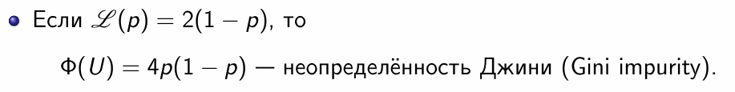
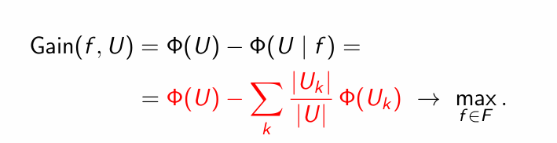
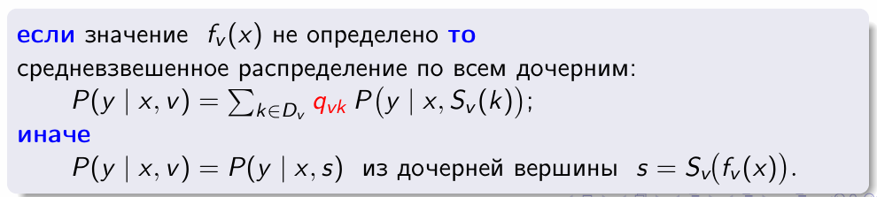
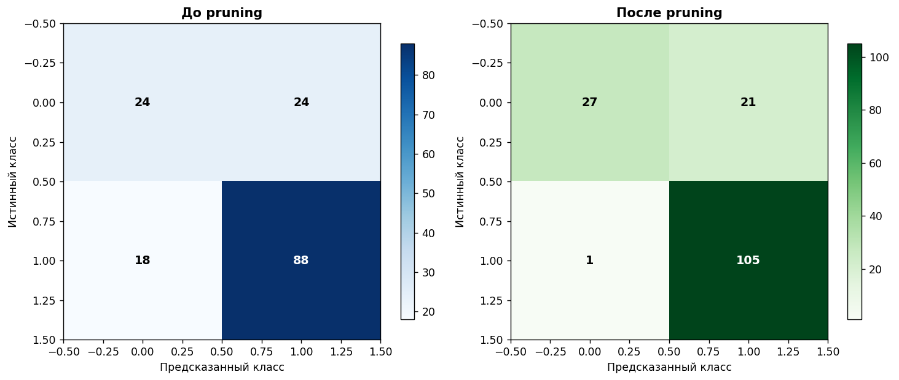
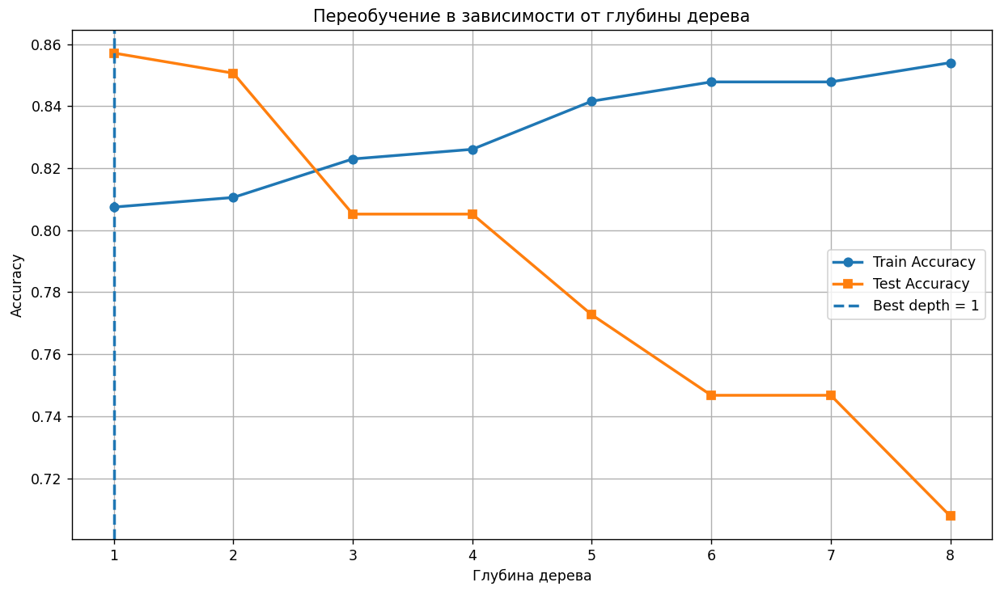
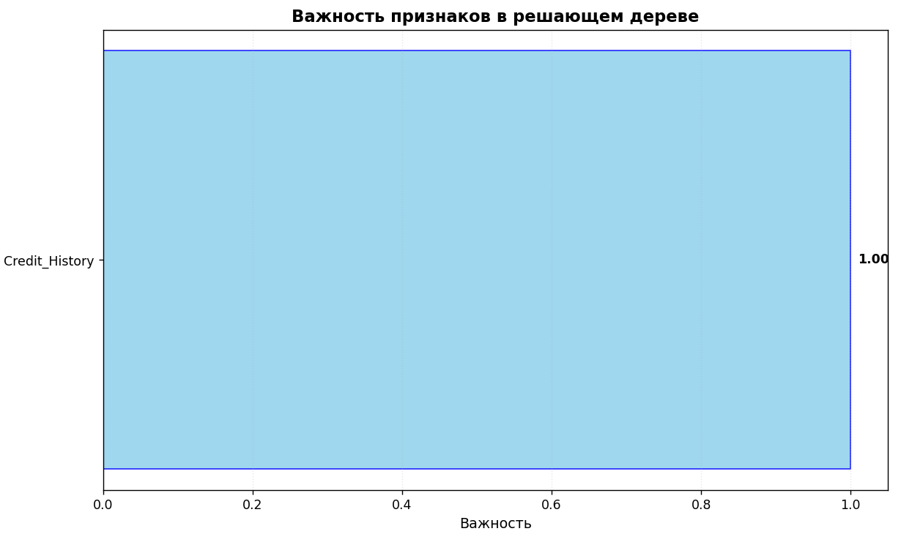
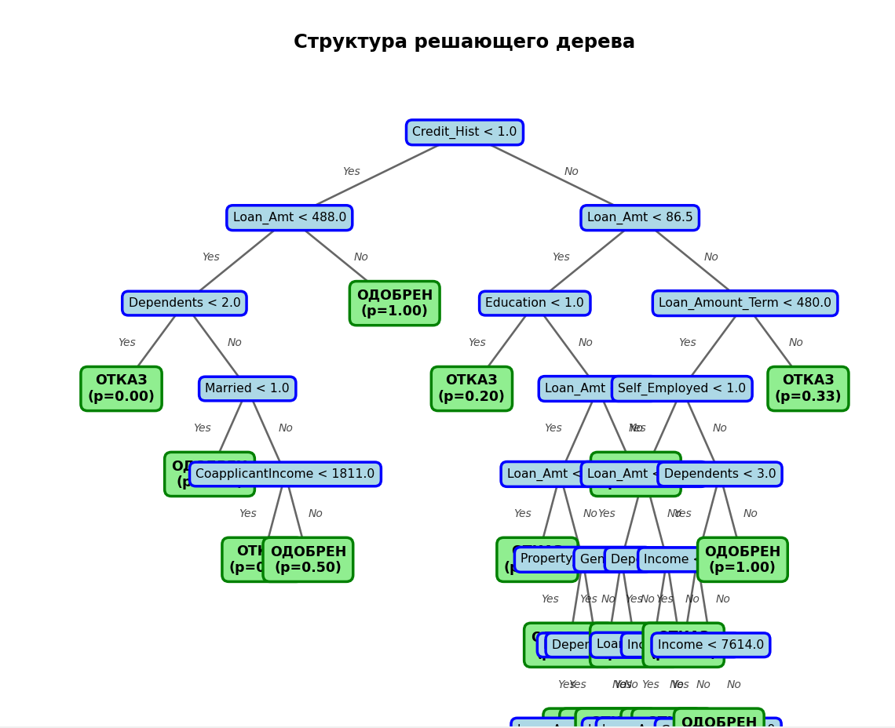
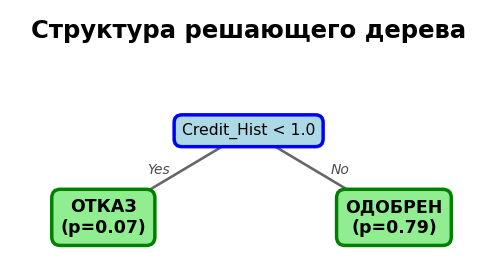

# Лабораторная работа №1. Логическая классификация

В рамках лабораторной работы предстоит реализовать алгоритм построения бинарного решающего дерева и сравнить его с эталонной реализацией.

На лекции были рассмотрены следующие алгоритмы:
* алгоритм построения бинарного решающего дерева ID3;
* алгоритм редукции дерева;
* алгоритм бинаризации вещественного признака;

## Задание

- [x] Выбрать датасет для классификации, например на [kaggle](https://www.kaggle.com/datasets?tags=13302-Classification);
  - [x] Датасет должен содержать пропуски;
  - [x] Датасет должен содержать категориальные и количественные признаки;
- [x] Реализовать алгоритм построения дерева ID3 с критерием Джини;
- [x] Реализовать обработку пропущенных значений через оценку вероятности;
- [x] Обучить дерево на выбранном датасете;
- [x] Оценить качество классификации;
- [x] Реализовать алгоритм редукции дерева;
- [x] Сравнить качество классификации и регрессии до и после редукции дерева;
- [x] Сравнить с [эталонной](https://scikit-learn.org/stable/) реализацией бинарного решающего дерева;
  - [x] Сравнить качество работы;
- [x] Подготовить небольшой отчет о проделанной работе.

___
# Отчет

В рамках работы реализовывался алгоритм **ID3** (Iterative Dichotomiser) для построения бинарного решающего дерева.

## Используемый датасет

https://www.kaggle.com/datasets/altruistdelhite04/loan-prediction-problem-dataset/data

Для работы я выбрала **Loan Prediction** - датасет для предсказания одобрения кредита.

Ключевые характеристики:
- **Задача:** бинарная классификация (`Loan_Status`: Y/N → 1/0)
- **Объём:** 614 объектов (после разделения: train=322, val=138, test=154)
- **Признаки:** 12 столбцов - смешанные типы (категориальные: `Gender`, `Education`; числовые: `Income`, `LoanAmount`)
- **Пропуски:** 76 в train-выборке (в `Credit_History`, `LoanAmount`, `Gender` и др.)


### Критерий разбиения
Использовалась неопределённость Джини:



Прирост информации считался по формуле:



### Обработка пропусков
В отличие от стандартных реализаций, здесь пропуски не заполнялись заранее. Вместо этого использовалась следующая логика:
- При обучении: объекты с `NaN` по текущему признаку исключались из расчёта Gain
- При предсказании: если значение признака пропущено, возвращается средневзвешенная вероятность по дочерним вершинам



### Pruning (Reduced Error Pruning)
Чтобы дерево не переобучалось, после обучения применялось усечение:
- Обход снизу вверх
- Для каждого внутреннего узла сравнивалась ошибка поддерева и ошибки листа на валидационной выборке
- Если замена на лист не ухудшала качество - ветви обрезались

## Реализация

### Ключевые решения

1. **Кодирование признаков**
   - Бинарные (`Gender`, `Married` и т.д.) → маппинг `{Yes:1, No:0}`
   - `Dependents`: значение `'3+'` заменено на `3`
   - `Property_Area`: label encoding (`Urban:2, Semiurban:1, Rural:0`)
   - Пропуски **не заполнялись** - оставлены как `NaN` для тестирования логики обработки

2. **Бинаризация числовых признаков**
   - Для признаков с >10 уникальных значений перебирались пороги между соседними значениями
   - Для категориальных (мало уникальных) - сплит по самим значениям

3. **Особенности pruning**
   - Реализован bottom-up обход
   - Для каждого узла отслеживалась маска объектов валидации, дошедших до него
   - Сравнивали ошибку не на всей выборке, а только на релевантных объектах


## Результаты

### Метрики классификации

| Модель | Test Accuracy | Test F1 |
|--------|--------------|---------|
| Custom ID3 (до pruning) | 0.727 | 0.807 |
| **Custom ID3 (после pruning)** | **0.857** | **0.905** |
| Sklearn DecisionTreeClassifier | 0.786 | 0.849 |

> После pruning точность выросла на 13%. Упрощение модели улучшило обобщающую способность

### Извлечённые правила (после pruning)
```
1. ЕСЛИ [Credit_History < 1.0]
   → ОТКАЗ (класс=0, вероятность=0.07, глубина=1)

2. ЕСЛИ [Credit_History >= 1.0]
   → ОДОБРЕН (класс=1, вероятность=0.79, глубина=1)
```

Получилось буквально два правила. На первый взгляд они слишком простые, но:
- `Credit_History` по сути действительно хороший признак в кредитном скоринге
- Остальные признаки добавляли шум, и pruning их отсёк
- Результат на тесте это подтверждает

### Визуализации
- Confusion Matrix наглядно показала эффект от pruning. До обрезки модель допускала 18 ложных отказов (FN=18), то есть отклоняла хороших заёмщиков. 
После pruning эта ошибка сократилась до FN=1 - в 18 раз. Мы перестали терять клиентов с хорошей кредитной историей. 
При этом общее количество правильных предсказаний выросло с 112 до 132 объектов.



- График зависимости точности от глубины дерева подтвердил гипотезу о переобучении:
  - Train accuracy монотонно растёт с увеличением глубины. Дерево запоминает тренировочные данные
  - Test accuracy падает после глубины 2 - модель теряет способность обобщать
  - Оптимальная глубина = 1, что и показал pruning



- Важность признаков после обрезки показала 100% вклад Credit_History. Pruning удалил все остальные признаки как избыточные. 
Датасет устроен так, что кредитная история доминирует над остальными факторами.



- Структура дерева до pruning демонстрирует классическое переобучение: глубина 7-8, множество узлов с малым количеством объектов, 
сложные условия. Такое дерево практически невозможно интерпретировать и оно плохо работает на новых данных.



После pruning осталось буквально два правила:



Это хороший пример того, как Reduced Error Pruning отбрасывает шум и оставляет только статистически надёжные закономерности. 
Простота модели выросла в разы, а качество на 13%.
---

## Анализ результатов

Модель показала хороший результат благодаря сочетанию нескольких факторов.

Во-первых, датасет поддался простому правилу. В задачах кредитного скоринга кредитная история действительно часто 
оказывается решающим фактором.

Во-вторых, обработка пропусков без заполнения сохранила информацию об объектах, которые иначе пришлось бы удалять или искажать. 
В моём датасете было 76 пропусков в тренировочной выборке. Если бы я заполняла их медианой или модой (как делает sklearn по умолчанию), 
это внесло бы шум. Вероятностная логика позволила использовать эти объекты как есть.

В-третьих, pruning убрал переобучение. До обрезки дерево имело глубину 7-8 и запоминало тренировочные данные. 
После осталось только то, что действительно работает на валидации.

Почему превзошли sklearn?
Sklearn по умолчанию заполняет пропуски перед обучением, что вносит искажения. Моя реализация использовала вероятностную логику: 
если признак пропущен, предсказание формируется как средневзвешенное от обоих детей. На малых выборках с пропусками это даёт заметный эффект.

## Выводы
В ходе лабораторной работы я реализовала алгоритм ID3 для построения решающего дерева классификации.

1. Алгоритм работает. Реализация с нуля позволила разобраться в деталях: расчёт критерия Джини, обработка пропусков, рекурсивное построение дерева.
2. Pruning необходим. Без усечения дерево переобучается (глубина 7-8, Test Acc=0.727). 
   После Reduced Error Pruning структура упростилась до глубины 1, а точность выросла до 0.857.
3. Вероятностная логика превзошла стандартное заполнение медианой/модой (sklearn: 0.786).
4. Интерпретируемость - преимущество логических методов. Итоговая модель это два понятных правила на естественном языке.