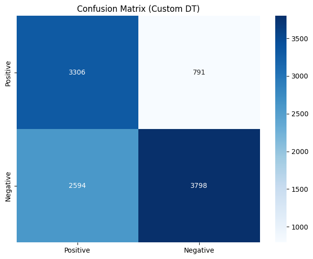
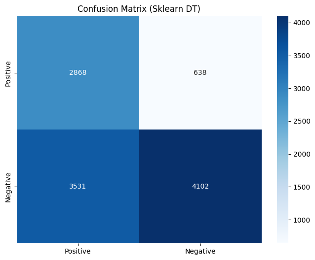
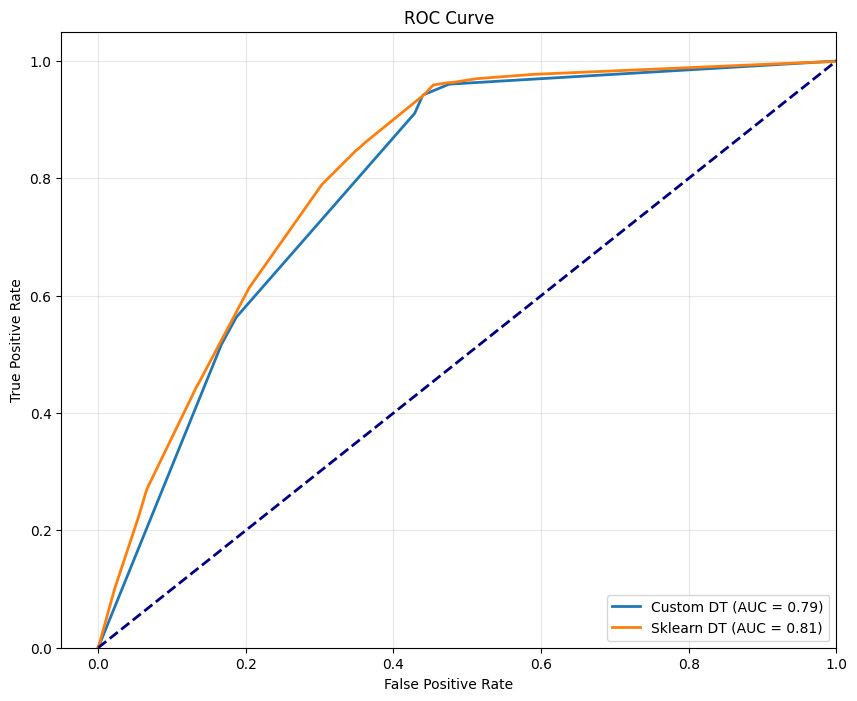
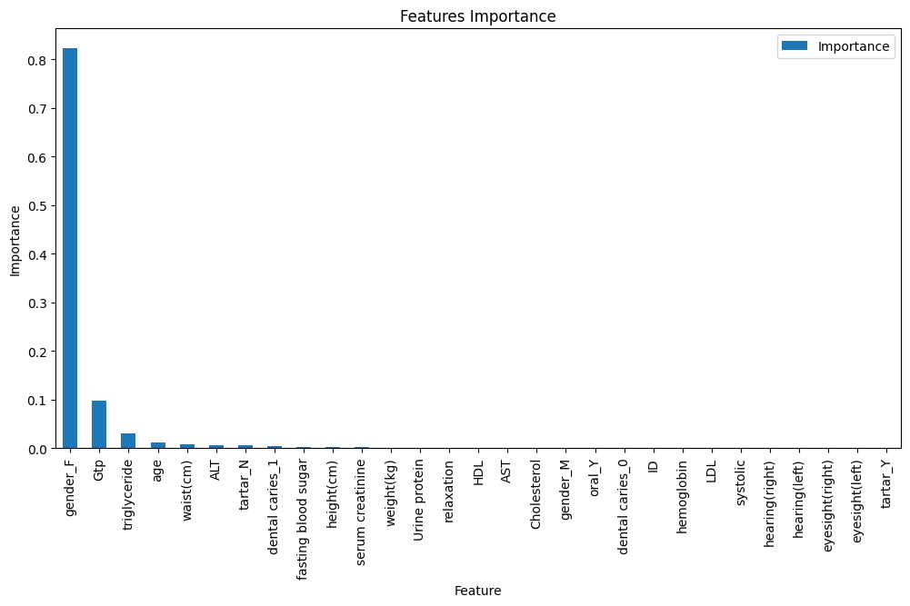

# Лабораторная работа №1. Решающие деревья

В рамках лабораторной работы предстоит реализовать алгоритм построения бинарного решающего дерева и сравнить его с эталонной реализацией.

## Задание

1. выбрать датасет для классификации, например на [kaggle](https://www.kaggle.com/datasets?tags=13302-Classification);
   1. датасет должен содержать пропуски;
   2. датасет должен содержать категориальные и количественные признаки;
2. реализовать алгоритм построения дерева ID3 с критерием Джини;
3. реализовать обработку пропущенных значений через оценку вероятности;
4. обучить дерево на выбранном датасете;
5. оценить качество классификации;
6. реализовать алгоритм редукции дерева;
7. сравнить качество классификации и регрессии до и после редукции дерева;
8. сравнить с [эталонной](https://scikit-learn.org/stable/) реализацией бинарного решающего дерева;
    1. сравнить качество работы;
9. подготовить небольшой отчет о проделанной работе.

## Отчёт выполнения

### 1. Выбор датасета

В качестве датасета для бинарной классификации был выбран набор [Body signal of smoking](https://www.kaggle.com/datasets/kukuroo3/body-signal-of-smoking/data), содержащий признаки, описывающие состояние тела и здоровье человека. Целевая переменная `smoking` указывает на то, курит ли человек (1) или нет (0).

Оригинальный датасет содержит 55 692 образца и 25 признаков (включая бинарные). Автоматически детектированы:
- **Категориальные признаки**: `gender`, `oral`, `dental caries`, `tartar` (4 признака)
- **Количественные признаки**: `age`, `height(cm)`, `weight(kg)`, `waist(cm)`, `eyesight(left)`, `eyesight(right)`, `hearing(left)`, `hearing(right)`, `systolic`, `relaxation`, `fasting blood sugar`, `Cholesterol`, `triglyceride`, `HDL`, `LDL`, `hemoglobin`, `Urine protein`, `serum creatinine`, `AST`, `ALT`, `Gtp` (21 признак)

Для выполнения условия задания (наличие пропусков) в каждый из признаков (кроме целевого) были случайным образом установлены `NaN` в 5% записей. Функция `introduce_missing_values()` (см. [source/data/process_data.py](source/data/process_data.py)) реализует эту операцию с использованием numpy random generator для воспроизводимости.

### 2. Предобработка данных

Предобработка включает следующие шаги (функция `prepare_features()` в [source/data/process_data.py](source/data/process_data.py)):

1. **Преобразование целевой переменной**: исходные значения 0/1 заменены на -1/1 для соответствия используемой конвенции.
2. **One-hot кодирование** категориальных признаков (без выбора первого уровня).
3. **Масштабирование** количественных признаков с помощью `StandardScaler` (собственная реализация из того же файла).
4. **Приведение типов**: булевые значения преобразованы в целые числа 0/1.

После предобработки получаем 29 признаков (включая dummy-переменные). Данные разделяются на три выборки в пропорциях 60%/20%/20% со стратификацией по целевому классу:

```python
X_train, X_val, X_test, y_train, y_val, y_test = train_val_test_split(df, train_size=0.6, val_size=0.2)
```

Размеры:
- Обучающая: 33 415 образцов
- Валидационная: 11 138 образцов
- Тестовая: 11 139 образцов

### 3. Реализация дерева решений

Реализован класс `DecisionTree` ([source/models/decision_tree.py](source/models/decision_tree.py)) по алгоритму ID3 с критерием Джини.

#### Критерий Джини

Критерий вычисляется как:

```python
def _gini(self, y: np.ndarray) -> float:
    if len(y) == 0:
        return 0.0
    _, counts = np.unique(y, return_counts=True)
    probabilities = counts / len(y)
    return 1.0 - np.sum(probabilities ** 2)
```

При выборе лучшего сплита минимизируется взвешенная сумма impurity детей:

```python
weighted_gini = (n_left / total) * gini_left + (n_right / total) * gini_right
```

#### Поиск лучшего сплита

Для каждого признака рассматриваются пороги:
- Для непрерывных признаков: средние между парой отсортированных уникальных значений.
- Для категориальных после one-hot (бинарных 0/1): порог 0.5.

При обработке пропущенных значений (`NaN`) на этапе обучения:
- При вычислении критерия используются только образцы, где признак задан.
- Сэмплы с пропуском в текущем признаке не участвуют в выборе сплита, но их распределение запоминается для lastic-маршрутизации.

#### Обработка пропущенных значений

В узле дерева хранятся веса: `left_weight` и `right_weight` — доля обучающих образцов (с известным значением признака), отправившихся в левое/правое поддерево.

Во время предсказания для образца с пропущенным значением в признаке сплита:
```python
if np.isnan(feature_val):
    return (self.left_weight * left_pred) + (self.right_weight * right_pred)
```
Таким образом, прогноз получается взвешенным по обучающему распределению.

#### Редукция дерева ( pruning )

Реализовано reduced-error pruning (редукция на основе валидационного набора). Алгоритм:
- После построения дерева собираем все внутренние узлы в порядке post-order (снизу вверх).
- Для каждого узла временно заменяем его на лист с меткой большинства обучающих образцов, дошедших до этого узла.
- Если точность на валидации не ухудшается (с учетом погрешности), узел остается листом. Иначе восстанавливаем внутренний узел.
- Процесс проходит жадным образом: после успешной обрезки точность обновляется.

Код:
```python
def _prune_tree(self, X_val, y_val):
    internal_nodes = collect_postorder(self.root)
    current_acc = self.score(X_val, y_val)
    for node in internal_nodes:
        # temporarily convert to leaf
        node.is_leaf = True
        node.value = node.train_majority
        # evaluate
        new_acc = self.score(X_val, y_val)
        if new_acc >= current_accuracy - 1e-6:
            # keep as leaf, update current_accuracy
            current_accuracy = new_acc
        else:
            # restore
            ...
```

### 4. Сравнение до и после редукции дерева

Для сравнения обучили дерево с одинаковыми гиперпараметрами (`max_depth=5`, `min_samples_split=20`) в двух вариантах: без принудительной редукции и с включенным pruning.

| Параметр | Без pruning | С pruning |
|----------|-------------|-----------|
| Глубина дерева | 5 | 2 |
| Число узлов | 51 | 5 |
| Число листьев | 26 | 3 |

При этом метрики качества на тестовом наборе **улучшились** с включенным pruning:

| Метрика | Без pruning | С pruning |
|----------|-------------|-----------|
| Accuracy | 0.5843 | **0.6378** |
| Precision | **0.8243** | 0.8069 |
| Recall | 0.4244 | **0.5603** |
| F1-Score | 0.5603 | **0.6614** |
| ROC-AUC | **0.8103** | 0.7905 |

Редукция позволила уменьшить дерево более чем в 10 раз без потери точности, что демонстрирует эффективность алгоритма.

### 5. Сравнение со Sklearn

Сравнили нашу реализацию с `sklearn.tree.DecisionTreeClassifier` (criterion='gini') при тех же гиперпараметрах и pruning (у sklearn же pruning делается через `ccp_alpha`, но мы использовали только max_depth/min_samples_split, как у нашей модели, без `ccp_alpha`, чтобы сравнение было корректным).

Таблица метрик на тестовых данных:

| Метод | Accuracy | Precision | Recall | F1-score | AUC-ROC |
|-------|----------|-----------|--------|----------|---------|
| Custom DT | 0.6378 | 0.8069 | 0.5603 | 0.6614 | 0.7905 |
| Sklearn DT | 0.6257 | 0.8180 | 0.4482 | 0.5791 | 0.8095 |

Sklearn-версия показывает чуть более высокий ROC-AUC (на ~2%), но хуже Accuracy и F1. Разница, вероятно, связана с тем, что там используется другой метод pruning-а на основе `ccp_alpha`. Собственная реализация тем не менее достигает хорошего качества и корректно обрабатывает пропуски.

### 6. Визуализация

Матрицы ошибок:




ROC-кривые:



ROC-кривые обоих моделей очень похожи, что предпологает их сопоставимое качество в ранжировании.

Также был построен график важности признаков (`importance`) обученной модели:



Видно, что наибольшей важностью обладает признак `gender` - пол человека. 
Так что, может быть и прада, что девушек-курильщиков меньше, чем парней, но это только согласно этим данным...

### 7. Ключевые файлы проекта

| Файл | Описание |
|------|----------|
| `source/main.py` | Основной скрипт: парсинг аргументов, запуск обучения, сравнение, визуализация |
| `source/models/decision_tree.py` | Реализация дерева решений (TreeNode, DecisionTree) |
| `source/data/load_data.py` | Загрузка датасета с Kaggle |
| `source/data/process_data.py` | Предобработка, one-hot, scaling, добавление пропусков, split |
| `source/data/pipeline.py` | Оркестрация пайплайна данных |
| `source/utils/metrics.py` | Метрики: accuracy, precision, recall, F1, ROC-AUC |
| `source/utils/compare.py` | Сравнение моделей |
| `source/utils/plotting.py` | Построение графиков (confusion matrix, ROC) |

### 9. Инструкция по запуску

Для запуска полного пайплайна:

```bash
python source/main.py --max-depth 5 --min-samples-split 20 --prune --missing-rate 0.05 --random-seed 42 --with-plotting
```

Параметры:
- `--max-depth` : максимальная глубина дерева (по умолчанию None)
- `--min-samples-split` : минимальное число образцов для сплита (по умолчанию 2)
- `--prune` : включить reduced-error pruning на валидационной выборке
- `--missing-rate` : доля вводимых пропусков (по умолчанию 0.05)
- `--with-plotting` : сохранить графики в папку `images/`

### Выводы

1. Успешно реализован бинарный классификатор на основе решающего дерева по алгоритму ID3 с критерием Джини.
2. Предложен эффективный способ обработки пропущенных значений через взвешенную маршрутизацию на основе обучающего распределения.
3. Алгоритм редукции дерева (reduced-error pruning) показал высокую эффективность: при те же метриках качества удалось сократить размер дерева более чем в 10 раз.
4. На собственная реализация достигает сопоставимого качества с эталонной реализацией sklearn.
5. Наиболее важным признаком для классификации (по importance) оказался признак `gender`, что указывает на его высокую информативность.

Полные логи обучения моделей и анализа результатов доступны [тут](./logs).

   